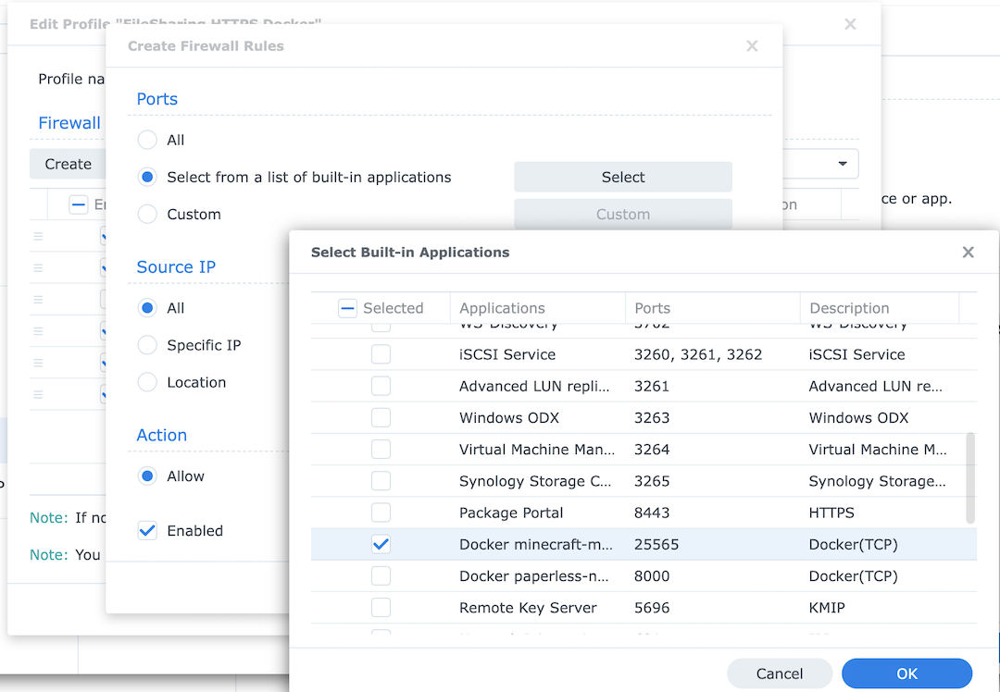
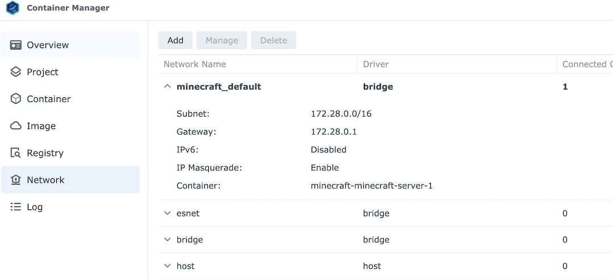
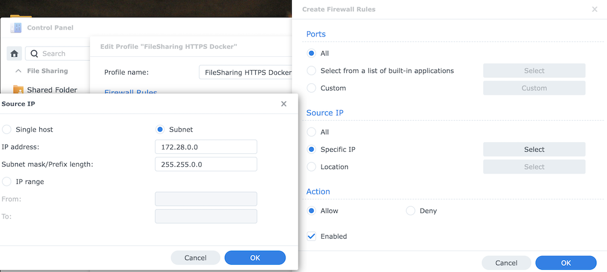

# Minecraft Server, Managed by Synology

Allows you to host a Minecraft Java server with Synology's container management utilities.
This project hosts a Docker image for the Java server & the Docker Compose configs for
ease of management by the [Synology Container Manager](https://www.synology.com/en-us/dsm/feature/docker).


## How to Install

Use the Container Manager within your NAS to create a new project, then either copy-and-paste
`docker-compose.yml` or upload it to create the new project. 

Before you start the project, modify the `volumes` list to point to the absolute path that hosts your world files.
As an example, if you create a new shared folder called "minecraft" on your primary storage volume, and you want to
host a world named "test," the absolute path might be `/volume1/minecraft/test`.

Modify the memory to be reserved for the Minecraft server, and add an operator username to make
sure you can administer the world. Once this is done, you can save the config and build the project
within the Synology Container Manager.

You will also need to forward port 25565 from your Synology NAS to the Docker container. You can do that
by adding the `Docker` minecraft service to the list of permitted inbound connections:



Be aware that the container will need outbound internet connectivity, which may not be allowed
by your firewall rules. If you need to create a new rule to allow the traffic, first find the 
network in use by your new project in the Container Manager network tab:



Then create a prioritized firewall rule to allow this network outbound access:




## How to Test an Image

A local test image can be created using:
```
docker build . -t ghcr.io/minecraft-synology:test
docker run ghcr.io/minecraft-synology:test
```
